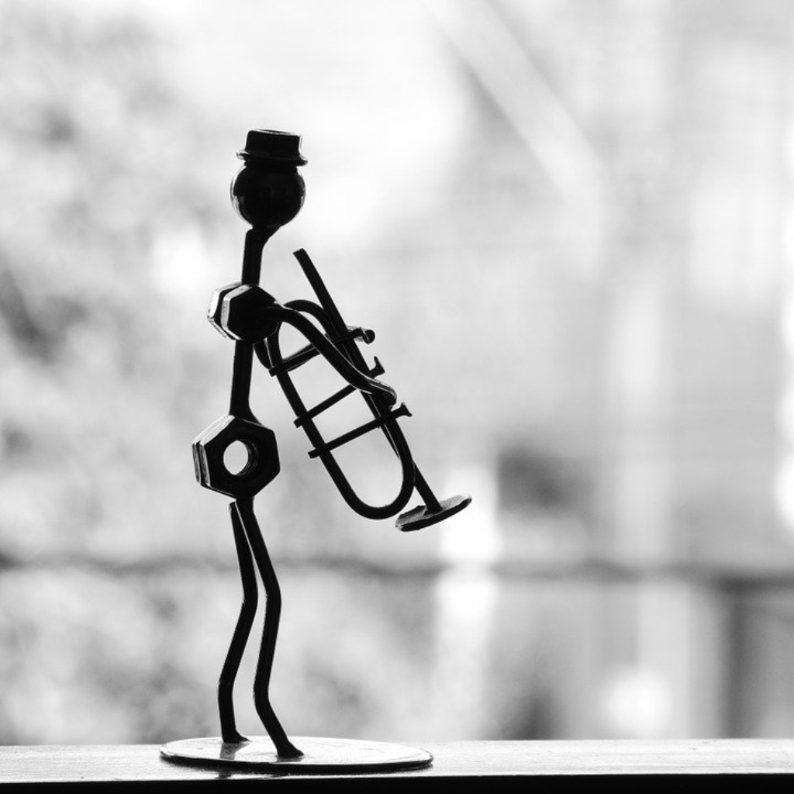

Often people under-appreciate the profound effect that your first gig has on your future potential in the music biz. I was fortunate enough to have a great first experience for my first professional gig. For many though, a poor experience at your first gig could be so highly discouraging that you may never choose to even try again professionally.

I hooked up with the local orchestral masters of New York and they showed me the ropes before I had my first real gig performing for a broadway musical. Those amazing people took me under their wing and, unaware to me, made my first gig memorable and ever since then I've wanted to perform and share my music with as many people as possible.

My suggestion is that you craft your first gig experience as best you can to ensure that you don't get thrown into an uncomfortable situation that may ruin your first gig and ultimately derail your music career.

> Craft your first gig experience as much as you can to heighten your music adventure!

